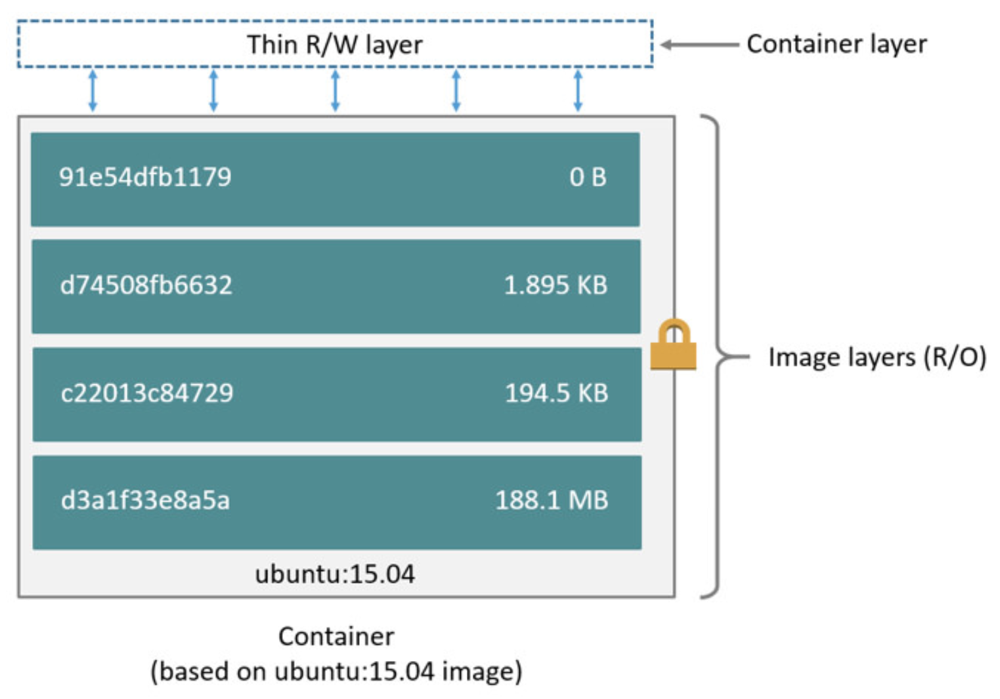

## Self-Mastery 101: Containers Technology ##
This contains all self-mastery notes on containers, starting with their histoy and latest advancements.

**Credits**: Linux Foundation course LFS253 is the source of knowledge.  

---

### Virtualization Fundamentals ###
1. These 3 linux OS based features are the building blocks of modern day containerisation. They have existed on a long time (> 20 years) as `OS Level Virtualization` techniques but only recent times did these features become more enriched that they are adapted for containers.  

1. The 3 most important features are `cgroups`, `namespaces` & `UnionFS`.

1. `cgroups` allow the limitation of memory, disk I/O, and network usage for a group of processes.  
In addition, cgroups may set usage quotas, and prioritize a process group to receive more CPU time or memory than other groups.  
Also, a group's resource usage can be measured for accounting and billing purposes, and its state can be controlled by freezing and restarting the group.

1. `Namespaces` may limit the visibility of cgroups, hostname, process IDs, IPC mechanisms, network interfaces and routes, users, and mounted file systems. To an isolated process running inside a namespace, a namespaced resource, such as the network, will appear as the process' own dedicated resource. Processes running inside a namespace are aware of any changes in the local namespaced system resources, however, such changes will not be visible to other processes or other namespaces.  
`Namespaces` isolate processes from one container to prevent them from modifying the hostname, network interfaces, or mounts for processes running in other containers. The processes isolated inside a container can only see system resources namespaced for that particular container. 

1. `UnionFS` allows the overlay of separate transparent file systems to produce an virtual single unified file system.
Several file systems, called branches, are virtually stacked, their contents appear to be merged, however, physically, they remain separate.  
The real physical separation, together with read-only and read-write access modes, help to prevent data corruption with the implementation of a `Copy-on-Write (CoW)` mechanism.  
`UniionFS` allows container images to be made at runtime, using heavy file linkages to main base image s source while allowing changes to be made to read writable file system.  

---

### Virtualization 101 ###
1. Operating system-level virtualization is a kernel's capability to allow creation and existence of multiple isolated environments, such as containers, on the same hosts, without a need to install a guest OS (unlike a full VM)

1. These containers or virtalizaed environments are limited by the kernel to its assigned devices. This separation allows programs to run in ther own assigned virual environment for better security and resource management.

1. It leverages a `CoW` mechanism type of stacked storage management model, shared by all containers.

1. Mechanisms implementing OS level virtualization are `chroot` (one of the oldest), `LXC` (Linux Containers), `Systemd-nspwan`

1. `chroot` - changing the root directory of a process and its children, to a virtual root, giving the impression the process has the real root directory of he OS, without the possibiliy of escaping to access the real root directory.

1. `LXC` introduced in 2008 on Linux systems. Leverages cgroups and chroot, with namespace isolation to limit resources and isolate from host OS.

1. `Systemd-nspawn` introdued in 2010 in Linux systems. Fully virtualize process tree, fiesystem, users, host and domain name. Processes cannot communicate aceoss containers. May run system services managed by `systemd`.

---

### Container Standards & Runtimes ###
1. Containers - allows shipping of application code along with its dependencies all packaged in a box, with a standard to "unbox" and execute it in different isolated environments. This ensures maximum portability and flexibility for quick feedback loop for code-to-deploy demands.

1. Standardization amongst containers frameworks and runtimes, has been lacking. Evolved now into 2 common standards: App Container (`appc`) and Open Container Initiative (`OCI`). Gradual convergence from App Container --> Open Container Initiative.

#### `appc` ####
1. Introduced in 2014 by CoreOS, Google and Redhat.

1. Defines its own Application Container Image (`ACI`) format for container images.

1. `appc` aims to speed up design and deployment of containers while ensuring integrity through crypto signatures.

1. Provides the following aspects to manage the container lfecycle:
- App Container Image (`ACI`)
- App Container Image Discovery
- App Conainer Pod
- App Container Executor (`ACE`)

#### `OCI` ####
1. Introduced in 2015 by Docker and other leaders.

1. `OCI` provides the following aspects:
- **Runtime Specification** -  defines how to run a container bundle that is unpacked on disk.
- **Image Format Specification** - defines the OCI Image Format that includes a manifest, a set of filesytem layers, a config file and an optional image index.

### Container Runtimes ###
1. Fundamentals: Container runtimes are responsible to provide an environment supporting basic operations with images and the running containers, that is both configurable and consistent;  
Regardless of the underlying infrastructure - whether an on-prem Data Center or a Cloud Infrastructure as a Service (IaaS), containers’ behavior is expected to be the same, thus allowing users to develop and test containers on any system across all tiers - from development to production.

1. Different container runtimes:
- `runc` - limited capabilities.
- `containerd` - designed to run as en embedded daemon of a more robust container management system; not used directy by end users; used in Docker engine, Kubernetes, GKE etc; utilizes `runc`. Open-sourced by Docker
- `Docker` - most robust but also complex. Uses `LXC` initially as its runtime but has developed and open-sourced `libcontainer` to replace `LXC`. Leverages   
  
-- **Docker client** - CLI tool; runs docker commands against a Docker daemon host.  
-- **Docker host** - `dockerd` responsible for building, running, and distributing Docker containers. A daemon can act alone, or interact with other daemons to manage distributed Docker services across multiple Docker hosts clustered together. It listens for Docker API requests from the Docker client and manages Docker objects such as images, containers, networks, and volumes.  
-- **Docker registries** - popular public ones: Docker Hub, quay (K8S). Can be private and self hosted too.  
-- **Latest - Docker Desktop** - all in one installer for all docker components.
- `rkt` - developed by CoreOS; implements the `appc` specification. Interoperable with Docker Hub and docker based images. No longer maintained by Cloud Native Computing Foundation.
- `CRI-O` - a lightweight alternative to using Docker or rkt as the runtimes for Kubernetes. The CRI-O runtime has been optimized for Kubernetes. CRI-O also supports container security. Not intended to be used by end-users too, like `containerd`.

---

### Image Operations ###
1. **Container image** - when loaded at runtime, a containr is a running instance of an image; many containers maybes started from the same image.

1. Image are stored in layered using `CoW` mechanism. Base image are stored at the bottom referenced by layered images on top which would contain different features for different container runtime needed.

1. Image registry - efficent and secure storage. Reusability of images.

1. Container image operations alow users to manage image lifecycle from creation to registry storage, prep for running as container.  
- Docker uses a `Dockerfile` - which contains a set of instructions for dockerd to build an image. Use `docker image build` or `docker builder build` to build an image (traditional method uses `docker build`.

5. NOTE: Pulling an image from say Docker Registry, using e.g. `docker image pull` only downloads the image to the local disk (local repo). It is just a container image; NOT YET a running container. See next section on how to create a container from an image downloaded.

---

### Container Operations ###
1. `docker` - modern docker commands group their tradiional methods based on these 4 context: *container,image, engine, system*. E.g. `docker image pull` versus `docker pull`; the old methods will be deprecated gradually.

1. Use `docker commit` to build an image from a container and its most recent configuration.

1. `rkt` operates on pods rather than containers. E.g. `rkt run` run a pod from a container image.

1. `podman` has very similar command syntax to docker. It is capable of managing containers, pods, container images both OCI-based and Docker-based. In addition to container image operations, Podman supports operations to manage the entire lifecycle of a container.

#### `docker` container opertions ####
1. Creating a container from an image - `docker container create -it [some image name downloaded to local repo]`; this command only creates the container but does not start it.

1. Start the container using - `docker container start [partial container ID]`.

1. Hostname of container by default is the container ID.

1. Inspect details of container using `docker container inspect [partial container ID]`.

---

### Building Container Images ###
1. 3 ways to build a container image:
- From scratch, e.g. using a dockerfile
- From a running container
- Convert a container image

2. Dockerfile is also supported by `buildah` and `podman`. Dockerfie is a set of instructions for the container CLI to take and build up an image.

1. Creating image from a running container involves exporting the container's root filesystem into a tar fie.

1. Conversion is typically from OCI to ACI container formats, which is no longer popular as the community embraces OCI standards moving forward.

1. NOTE: Using GCP, even if the VM instance is suspended (to save running costs except storage costs), the image created is still persisted on VM, after resume/restart.  
Also this applies to even running containers after suspend and restart!

#### Dockerfile ####
1. 2 types of format: Shell Form and Exec Form (prefered by users). Shell Form runs the instructions in a command line shell. While Exec Form runs directly inside the container.

1.  See https://docs.docker.com/engine/reference/builder/ for details of dockerfile instructions. 2 main categories: **build time** and **run time** instructions.

1. `.dockerignore` file is used to exclude files and directories during docker image build process, where the docker client zips the referenced context folder and send it to Docker Host.

---

### Container Networking ###
1. The container network enables communication between microservices running inside containers, containers running on the same host, running on different hosts, or a container and other applications and services from anywhere in the world.

1. Two container networking standards: Docker Container Network Model (`CNM`) and the CoreOS Container Network Interface (`CNI`).

#### `CNM` - by Docker ####
1. Introduced by Docker and implemented by `libnetwork` project as the reference implementation.

1. Specifies a network sandbox, which abstracts networking specifics through plug-in drivers and exposed as "endpoints". Endpoints provide links from containers to an external host-based networking namespace and connect to other containers through their exposed endpoints.

1. The network sandbox supports multiple endpoints, each paired with a different network, thus allowing one container to access multiple networks simultaneously.

1. The `libnetwork` model uses a consistent programming interface and abstract away the underlying network connectivity -  using driver plugins. It supports drivers types for:
- **bridge** - internal within host networking space for containers to communicate with each other on the same host but cannot communicate with external parties;
- **overlay** - allows networking comms cross different hosts using VXLAN network encapsulation;
- **null** - no networking is required;
- **custom** - for 3rd party driver plugins.

#### `CNI` - by CoreOS ####
1. Adopted by projects such as Mesos, Amazon ECS, Kubernetes, Cloud Foundry, OpenShift, rkt.

1. Much simplier specs, focusing on network connectivity and releassing network resources once a container is deleted.

1. 3 main plugin groups for `CNI`: Main, IPAM, Meta.
- **Main** --> focuses on creating new interfaces and supporting the drivers types for bridge, ipvlan, loopback, macvlan, ptp, vlan, host-device, win-bridge, win-overlay;
- **IPAM** --> focuses on IP address allocation and includes plugins such as dhcp, host-local, static;
- **Meta** --> focuses on 3rd party plugin support and includes flannel compatibility, bandwidth limitation, firewall rules etc.

#### Docker networking drivers ####
1. **Bridge** - the default network type in Docker. To isolate container network from the host network, act as DHCP server to assign IP addresses. Useful for containers that talk to each other on the same host.
1. **Host** - trade off isolation by allowing containers to talk to host network directly. But it also eliminates the need for NAT (used in the Bridge driver case) and exposes container ports as host ports (performance improvement).
1. **Overlay** - Spanning multiple hosts, e.g. part of a cluster. Very popular with containers orhestraton platforms.
1. **Macvlan** - Allows a container to change its appearance on the network. For example, it allows a container to appear as a physical device with its own MAC address on the network.
1. **None** - Disables networking of a container.
1. **Network Plugins** - 3rd party network drivers integration into Docker.

1. When a Docker container is run, it attaches itself to the default **bridge** network. If you do an inspect of the running container and look at the field for `NetworkID` you will observe the ID of the bridge network as the value.

1. When Docker daemon starts, it creates a ​docker0​ network bridge on the host system. By default, all thecontainers connect to the ​docker0​ network bridge.

1. Docker creates a ​veth​ pair to attach a container to abridge. One end of the ​veth​ pair is attached to the bridge while the other end to the container. The bridgeside of the veth pair is ​vethcbba2f9@if7​ while the container end of the veth pair is ​eth0​.

---

### Container Storage ###

There are at least 4 types of storage options for **Docker**.

#### **1. Writeable layer within container** ####
1. Docker uses UnionFS (specifically its `CoW` strategy) to overlay a base container image with storage layers, such as ephemeral storage layer, custom storage layer, and config layer at the time a new container is created.  
  

1. The ephemeral storage, aka **container writeable layer**, is reserved for the container’s I/O operations. 
Each time the base container image is modified, Docker saves a copy of the image onto the writeabe layer for users to modify it. The base container image remains intact.

1. The writeable layer gets deleted along with a deleted container and hence it is not recommended to be used for persistent data; instead, a **docker volume, bind mount, tmpfs mount** should be mounted on the container to provide persistent storage which are not managed by UnionFS.

1. Docker users different storage drivers to manage this writeable layer. Read https://docs.docker.com/storage/storagedriver/ for more details of container layers, `CoW` strategy and storage drivers brief.

#### **2. Docker volumes** ####
1. Docker volumes are the preferred way to store persistent data permanently for containers.

1. Volumes allow sharing data among multiple running containers.

1. Can be managed directly by Docker CLI or API and easier to backup and restore.

1. Indpendent of underlying host system filesystem whereby a volume creates a new directory within the Docker's storage directory on the host machine and Docker manages its contents, e.g. `/var/lib/docker/volumes/` on Linux.

1. Can work on both Windows & Linux.

1. Using volume drivers allow you to connect to remote cloud storage providers for hosting the data.

1. The volume contents exits outside of the container and hence does not increase its size and does not disappear after containers are deleted. You can remove unused volumes using `docker volume prune`.

#### **3. Bind mount** ####
1. Limited functions compared to volumnes but still performant.

1. Leverages a file or directory of the *host machine* to mount to the container. Hence it is dependent on the host machine's filefsystem having a specific structure.

1. The file or directory is referenced by its full path on the host machine.

1. Bind mounts are good for sharing configuration files from the host machine to containers.

#### **4. tmpfs mount (only avail for Docker on Llnux)** ####
1. As opposed to volumes and bind mounts, a tmpfs mount is temporary, and only persisted in the host memory.

1. When the container stops, the tmpfs mount is removed, and files written there won’t be persisted.

1. Best used for cases when you do not want the data to persist either on the host machine or within the container.

1. But you cannot share files between containers and this functionality is only avail on Linux.
